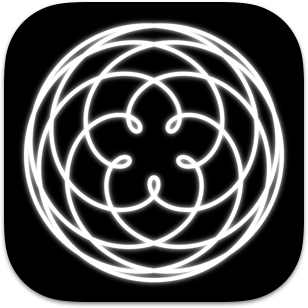
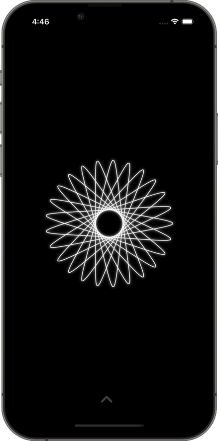
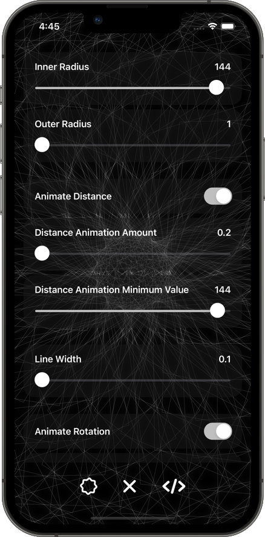

    
    
    
    

# Spiro

Swift Playgrounds 4 app created on the iPad^.

> ^ macOS and Xcode also used as explained below.

### 🏙 Screenshots

 

### 🤔 What is Spiro?

An interactive animating spirograph generator.

### 🧐 Why open source?

To share learnings. 

To show how powerful/easy SwiftUI can be to create an app.

## 🙇🏻 Credits

https://www.hackingwithswift.com/books/ios-swiftui/creating-a-spirograph-with-swiftui

## 🧑🏻‍💻 Getting Started

### Swift Playgrounds 4 on iPad 

Instructions to load `Spiro.swiftpm` from git into Swift Playgrounds 4 on the iPad.

### Xcode on macOS

Open `Spiro.swiftpm` via Xcode. Playgrounds 4 app running on macOS cannot open the project.

## Learnings

### iCloud vs git

### Swift Playgrounds 4 limitations

### Submission issues

### Development on Xcode

### Minimum deployment target

## What is next?

Just some ideas to further improve this project.

Thing | Description
-- | --
Canvas | https://developer.apple.com/documentation/swiftui/canvas to optimise drawing performance.
Smoother animations | The primary animation is performed by linearly incrementing or decrementing the distance. This will be smoother and provide an ease in ease out effect by using the values of a sine wave (improving that jarring sudden shift in direction).
Infinite animation | Super imposing 2 spirographs offset by half of the animation (so they both fade in, grow, and fade out) will make the animations appear like an infinite zoom effect.
Amount scroller | Using the `amount` field on the spirograph, we can show the gradual drawing effect to create the spirograph, this could be a nice addition to restore but directly conflicts with the primary animation.

