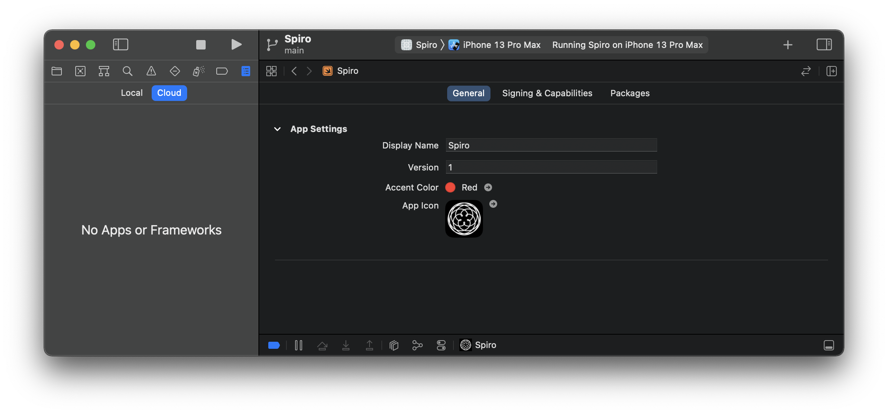

    
    
    
    

# Spiro

Swift Playgrounds 4 app created on the iPad^.

> ^ Xcode also used as explained below.

### 🏙 Screenshots

&nbsp;&nbsp;&nbsp;

### 🤔 What is Spiro?

An interactive animating spirograph generator.

I wanted to create an app to explore the development and deployment experience of Swift Playgrounds 4 on the iPad.

### 🧐 Why open source?

To share learnings. 

To show how powerful/easy SwiftUI can be to create an app, especially now with Swift Playgrounds 4.

Most of the code was obtained from [Creating a spirograph with SwiftUI](https://www.hackingwithswift.com/books/ios-swiftui/creating-a-spirograph-with-swiftui), so it makes sense to keep things transparent/open and hopes that it can help someone else out there.

## 🙇🏻 Credits

Huge sincere thanks goes to [Paul Hudson](https://twitter.com/twostraws) and his [100 days of SwiftUI](https://www.hackingwithswift.com/100/swiftui) series where I have learnt most of my SwiftUI knowledge. 

The code to draw these lovely hypotrochoids was obtained from
https://www.hackingwithswift.com/books/ios-swiftui/creating-a-spirograph-with-swiftui

## 🧑🏻‍💻 Getting Started

### Swift Playgrounds 4 on iPad 

There are many different methods to get `Spiro.swiftpm` to run on Swift Playgrounds 4 on the iPad.

Method | Steps
-- | --
Share from macOS via AirDrop | Clone this repo, share the `Spiro.swiftpm` via AirDrop to your iPad, it will open on Swift Playgrounds 4 on the iPad.
Share using iCloud Drive | Clone this repo, copy `Spiro.swiftpm` into your iCloud Drive, on the iPad open Swift Playgrounds 4, tap on `Locations` and locate `Spiro.swiftpm` within iCloud Drive.
Working copy app (using just the iPad) | Download https://apps.apple.com/us/app/working-copy/id896694807, Clone this repo within the working copy app, Open Swift Playgrounds 4 and working copy side by side using multitasking, Drag `Spiro.swiftpm` from working copy into "My Playgrounds".

### 💻 Xcode on macOS

Open `Spiro.swiftpm` via Xcode. Playgrounds 4 app running on macOS cannot open the project.

## 🧑🏻‍🏫 Learnings

Here are some things I've learnt along the way.

### ☁️ iCloud vs git

. | iCloud syncing | git
-- | -- | --
Pro | All automated and integrated into macOS and iPadOS | Version control, history, branch workflow, multiple contributors, etc
Con | No version control, no visual way to resolve conflicts | Requires 3rd party app (with paid subscription) to manually use git, or manually sharing project file back to macOS to manually commit, etc

After creating a new project in Swift Playgrounds 4 on the iPad, I noticed that is used iCloud drive to sync to the macOS. This allows us to work across both iPadOS and macOS on the same project.

However there is no version control, history, branching all the good things that come with git that are used on a daily basis for professional apps.

This image shows an issue of resolving conflicts based purely on device and timestamp.

After some investigation, I found this tweet https://twitter.com/WorkingCopyApp/status/1471231127264415744.

[Working copy](https://apps.apple.com/us/app/working-copy/id896694807) is an app that allows git access with drag and drop support...

...so we can drag the project file from `Working copy` to `Playgrounds` when we want to work on the iPad...

...and drag it back from `Playgrounds` to `Working copy` to commit any changes back to git.

### 🥺 Submission issues

After upgrading Swift Playgrounds to 4 and testing the submission functionality, I was given this error.

Upon accepting the latest terms and agreements I tried again with the feature complete version of the project and was faced with this error.

I proceeded to create the app like any other app by creating an explicit `App ID` via the `Certificates, Identifiers & Profiles` on the Apple developer portal. I have also created the new app via App Store Connect selecting the bundle ID I have just created. Upon attempting to submit again, I was given this error.

This did not seem right, after checking the team settings under App Settings, everything was correct so I decided to try again.

It appears to be successful, however after a short while, an email was received.

Upon inspecting the project on both Swift Playgrounds 4, and on Xcode, there was no such entitlement option (as Swift Playground 4 apps are simplified compared with normal Xcode projects files).

It was at this point that I decided to use Xcode to submit the binary. 

And it was submitted successfully this time. 💪🏻

### 🤔 Development on Xcode

By opening the project on Xcode, we can see that it is vastly simplified compared to ordinary Xcode projects. (no deployment target, launch screen, build number, build settings, build phases, etc.)

### 🤓 Minimum deployment target

After submitting to App Store Connect, we can inspect the build metadata and note the minimum deployment targets.

### ☁️ Xcode Cloud?

We can also note that Xcode Cloud does not support this project type yet.

## 🚀 What is next?

Just some ideas to further improve this project.

Thing | Description
-- | --
Canvas | https://developer.apple.com/documentation/swiftui/canvas to optimise drawing performance.
Smoother animations | The primary animation is performed by linearly incrementing or decrementing the distance. This will be smoother and provide an ease in ease out effect by using the values of a sine wave (improving that jarring sudden shift in direction).
Infinite animation | Super imposing 2 spirographs offset by half of the animation (so they both fade in, grow, and fade out) will make the animations appear like an infinite zoom effect.
Amount scroller | Using the `amount` field on the spirograph, we can show the gradual drawing effect to create the spirograph, this could be a nice addition to restore but directly conflicts with the primary animation.

